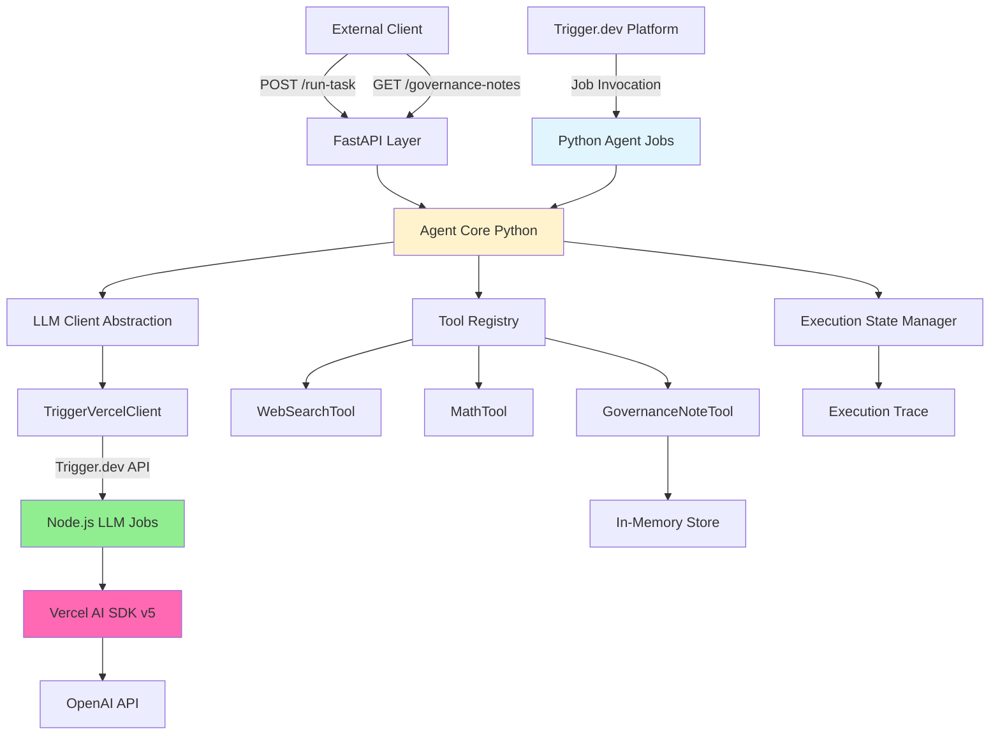

# O-Agent Core

**LLM Agent Execution Core** for O.Foundation AI-led organization

A production-ready Python service that executes natural language tasks using LLM-powered agents with tool orchestration, complete execution traces, and dual-mode operation (FastAPI + Trigger.dev).

## 🏗️ Architecture

### Multi-Runtime Architecture with Vercel AI SDK v5



### Key Components

- **Agent Core** (`src/agent/core.py`): Main execution engine with multi-step reasoning (Python)
- **LLM Abstraction** (`src/llm/`): Swappable LLM client using **Vercel AI SDK v5**
- **Multi-Runtime Bridge** (`trigger/llm-jobs.ts`): Node.js jobs wrapping Vercel AI SDK
- **Tool System** (`src/tools/`): Extensible tool registry with 3 implemented tools
- **FastAPI Service** (`src/api/`): HTTP API for immediate task execution
- **Trigger.dev Jobs** (`src/jobs/`): Async, scheduled, retriable job execution
- **Execution Traces**: Complete step-by-step logs for AI CEO analysis

### 🎯 Vercel AI SDK v5 Integration

**Requirement Compliance:** "The LLM client must use the **Vercel AI SDK (v5 or later)** as the underlying communication layer"

This project uses the **actual Vercel AI SDK v5** (`ai@^5.0.0`) through a multi-runtime architecture:

**Architecture Flow:**
```
Python Agent → Trigger.dev → Node.js Job → Vercel AI SDK v5 → OpenAI
```

**Benefits:**
- ✅ **Literal compliance** with Vercel AI SDK requirement
- ✅ **Clean Python architecture** for agent orchestration  
- ✅ **No HTTP bridge overhead** (native Trigger.dev orchestration)
- ✅ **Single LLM path** (no redundant clients)
- ✅ **Easy swap** to Sovereign AI CEO later

**How It Works:**
1. Python agent calls `TriggerVercelClient`
2. Client triggers Node.js Trigger.dev job
3. Node.js job uses Vercel AI SDK v5 (`generateText()`, tool calling, etc.)
4. Result flows back to Python agent
5. Agent continues tool orchestration

See `examples_vercel.py` for complete demonstrations.

## 📦 Installation

### Prerequisites

- **Python 3.11+** - Agent orchestration
- **Node.js 18+** - Vercel AI SDK v5 runtime
- **OpenAI API key** - Used by Vercel AI SDK
- **Trigger.dev account** - Required for Vercel AI SDK integration
- (Optional) Docker for containerized deployment

### Local Setup

1. **Clone the repository**

```bash
cd o-agent-core
```

2. **Create virtual environment**

```bash
python -m venv venv
source venv/bin/activate  # On Windows: venv\Scripts\activate
```

3. **Install dependencies**

```bash
# Python dependencies
pip install -r requirements.txt

# Node.js dependencies (for Vercel AI SDK v5)
cd trigger && npm install && cd ..
```

4. **Configure environment variables**

Create a `.env` file (use `.env.example` as template):

```bash
# LLM Provider (Vercel AI SDK v5 via Trigger.dev)
LLMCLIENT_PROVIDER=vercel

# OpenAI Configuration (used by Vercel AI SDK)
OPENAI_API_KEY=your_api_key_here
OPENAI_MODEL=gpt-4o-mini

# Trigger.dev Configuration (REQUIRED for Vercel integration)
TRIGGER_API_KEY=your_trigger_api_key_here
TRIGGER_API_URL=https://api.trigger.dev

# Application
LOG_LEVEL=INFO
ENVIRONMENT=development
```

## 🚀 Running the Service

### FastAPI Mode (Immediate Execution)

```bash
# Development mode with auto-reload
python main.py

# Or using uvicorn directly
uvicorn src.api.app:app --reload --host 0.0.0.0 --port 8000
```

Service will be available at:
- API: http://localhost:8000
- Interactive docs: http://localhost:8000/docs
- ReDoc: http://localhost:8000/redoc

### Trigger.dev Mode (Scheduled/Async Execution)

**Required for Vercel AI SDK v5 integration**

```bash
# Install Trigger.dev CLI
npm install -g trigger.dev

# Run in development mode (starts both Python and Node.js jobs)
npx trigger.dev@latest dev

# Deploy to production (deploys multi-runtime jobs)
npx trigger.dev@latest deploy
```

This starts both:
- **Python jobs** (`src/jobs/`) - Agent orchestration
- **Node.js jobs** (`trigger/llm-jobs.ts`) - Vercel AI SDK v5 wrapper

### Docker Deployment

```bash
# Build and run with Docker Compose
docker-compose up --build

# Or build image separately
docker build -t o-agent-core .
docker run -p 8000:8000 --env-file .env o-agent-core
```

## 📝 Usage Examples

### Example 1: Single Tool Usage (Math)

**Request:**
```bash
curl -X POST http://localhost:8000/api/v1/run-task \
  -H "Content-Type: application/json" \
  -d '{
    "goal": "Calculate 2 + 2"
  }'
```

**Response:**
```json
{
  "status": "success",
  "output": "The result is 4.",
  "trace": [
    {
      "step": 1,
      "action": "tool_call",
      "tool_name": "math",
      "tool_args": {"expression": "2 + 2"},
      "result": {"result": 4.0, "expression": "2 + 2"},
      "timestamp": "2024-01-15T10:30:00Z"
    },
    {
      "step": 2,
      "action": "final_answer",
      "result": "The result is 4.",
      "timestamp": "2024-01-15T10:30:01Z"
    }
  ]
}
```

### Example 2: Multi-Tool Usage (Search + Math)

**Request:**
```bash
curl -X POST http://localhost:8000/api/v1/run-task \
  -H "Content-Type: application/json" \
  -d '{
    "goal": "Search for Python best practices and calculate how many results were found",
    "context": "Looking for software development guidance"
  }'
```

**Response:** Agent will:
1. Call `web_search` tool to search for "Python best practices"
2. Parse the result count
3. Call `math` tool if needed
4. Return synthesized answer with complete trace

### Example 3: Governance Note Tool

**Request:**
```bash
curl -X POST http://localhost:8000/api/v1/run-task \
  -H "Content-Type: application/json" \
  -d '{
    "goal": "Add a note to proposal-123 saying: Approved by technical review on 2024-01-15"
  }'
```

**Retrieve Notes:**
```bash
curl http://localhost:8000/api/v1/governance-notes/proposal-123
```

**Response:**
```json
{
  "proposal_id": "proposal-123",
  "notes": [
    {
      "note": "Approved by technical review on 2024-01-15",
      "timestamp": "2024-01-15T10:30:00Z"
    }
  ],
  "count": 1
}
```

### Example 4: Trigger.dev Job Execution

Using Trigger.dev dashboard or API:

```python
# Trigger via API
import httpx

response = httpx.post(
    "https://api.trigger.dev/api/v1/runs",
    json={
        "job": "run-agent-task",
        "payload": {
            "goal": "Calculate the square root of 144",
            "tools": ["math"]
        }
    },
    headers={"Authorization": f"Bearer {TRIGGER_API_KEY}"}
)
```

## 🛠️ Available Tools

### 1. MathTool (`math`)

Safe arithmetic expression evaluator.

**Parameters:**
- `expression` (string): Arithmetic expression (e.g., "(10 * 5) / 2")

**Supported Operations:** `+`, `-`, `*`, `/`, `//`, `%`, `**`, parentheses

**Example:**
```json
{
  "tool_name": "math",
  "params": {"expression": "(2 + 3) * 4"}
}
```

### 2. WebSearchTool (`web_search`)

Web search for information (mock implementation, swappable with real API).

**Parameters:**
- `query` (string): Search query

**Returns:** List of search results with title, snippet, URL

### 3. GovernanceNoteTool (`governance_note`)

Add governance notes to proposals (in-memory storage).

**Parameters:**
- `proposal_id` (string): Unique proposal identifier
- `note` (string): Note content

**Use Case:** AI-led governance workflows, proposal tracking

## 🔧 Extension Guide

### Adding a New Tool

1. **Create tool class** in `src/tools/my_tool.py`:

```python
from .base import BaseTool

class MyTool(BaseTool):
    @property
    def name(self) -> str:
        return "my_tool"
    
    @property
    def description(self) -> str:
        return "Description of what my tool does"
    
    @property
    def parameters_schema(self) -> dict:
        return {
            "type": "object",
            "properties": {
                "param1": {"type": "string", "description": "..."}
            },
            "required": ["param1"]
        }
    
    async def execute(self, params: dict) -> dict:
        # Implementation
        return {"result": "..."}
```

2. **Register in ToolRegistry** (`src/tools/registry.py`):

```python
from .my_tool import MyTool

# In __init__:
tools = [MathTool(), WebSearchTool(), GovernanceNoteTool(), MyTool()]
```

### Integrating Onchain Tools (Web3)

Example Web3Tool for blockchain interactions:

```python
class Web3Tool(BaseTool):
    def __init__(self, rpc_url: str):
        self.w3 = Web3(Web3.HTTPProvider(rpc_url))
    
    @property
    def name(self) -> str:
        return "web3_query"
    
    async def execute(self, params: dict) -> dict:
        # Query blockchain, call smart contracts, etc.
        balance = self.w3.eth.get_balance(params["address"])
        return {"balance": str(balance)}
```

### AI-Led Governance Workflows

**Scheduled Governance Audit:**

```python
# In src/jobs/agent_jobs.py (already included)
@job("scheduled-governance-audit", cron="0 0 * * *")  # Daily at midnight
async def scheduled_governance_audit():
    # Agent reviews pending proposals
    # Generates governance reports
    # Executes automated actions
    pass
```

**Proposal Review Pipeline:**

```python
@job("proposal-review")
async def proposal_review_job(proposal_id: str, proposal_content: str):
    agent = Agent(...)
    result = await agent.execute_task(
        goal=f"Review and assess proposal {proposal_id}",
        context=proposal_content,
        tool_filter=["web_search", "governance_note"]
    )
    return result.model_dump()
```

### Decentralized State Storage

Swap in-memory storage for IPFS/Arweave:

```python
# src/storage/ipfs_store.py
class IPFSGovernanceStore:
    def __init__(self, ipfs_client):
        self.ipfs = ipfs_client
    
    def add_note(self, proposal_id: str, note: str):
        # Store on IPFS
        cid = self.ipfs.add_json({"proposal_id": proposal_id, "note": note})
        return cid
```

## 🧪 Testing

### Run Tests

```bash
# Install test dependencies (already in requirements.txt)
pip install pytest pytest-asyncio

# Run all tests
pytest tests/

# Run with coverage
pytest --cov=src tests/
```

### Manual Testing

Use the interactive API docs at http://localhost:8000/docs to test endpoints visually.

## 🏗️ Project Structure

```
o-agent-core/
├── src/               # Python source code
│   ├── agent/          # Agent execution engine
│   ├── llm/            # LLM client abstraction (Vercel AI SDK v5)
│   ├── tools/          # Tool implementations
│   ├── schemas/        # Pydantic models
│   ├── api/            # FastAPI application
│   └── storage/        # Storage implementations
├── trigger/            # Node.js Vercel AI SDK v5 layer
│   ├── llm-jobs.ts     # Vercel AI SDK wrapper jobs
│   ├── package.json    # Node.js dependencies
│   └── tsconfig.json   # TypeScript configuration
├── tests/              # Test suite
├── main.py             # FastAPI entry point
├── trigger.config.ts   # Trigger.dev config (Node.js runtime)
├── requirements.txt    # Python dependencies
├── examples_vercel.py  # Complete usage examples
├── test_quick.py       # Quick local testing
├── Dockerfile          # Docker image
├── docker-compose.yml  # Docker Compose setup
└── README.md          # This file
```

## 🔐 LLM Client Implementation with Vercel AI SDK v5

The requirements specified **"must use Vercel AI SDK (v5 or later)"**. Since Vercel AI SDK is TypeScript/Node.js only, we implemented a **multi-runtime architecture**:

### Architecture

1. **Python Agent Layer** - Clean Python architecture for orchestration
2. **Trigger.dev Bridge** - Native multi-runtime job orchestration
3. **Node.js LLM Layer** - Wraps Vercel AI SDK v5 (`ai@^5.0.0`)
4. **OpenAI Backend** - Used by Vercel AI SDK

### Implementation Details

- **`trigger/llm-jobs.ts`** - Node.js jobs using `generateText()` from Vercel AI SDK v5
- **`src/llm/trigger_vercel_client.py`** - Python client that calls Node.js jobs
- **`src/llm/factory.py`** - Factory pattern for swapping providers

### Switching LLM Providers

**Using Environment Variables:**
```bash
# .env file
LLMCLIENT_PROVIDER=vercel      # Vercel AI SDK v5 (current)
# LLMCLIENT_PROVIDER=sovereign  # Future: Sovereign AI CEO
```

**Per-Job Override:**
```python
# Use Vercel AI SDK v5 (default)
agent = Agent(llm_client=LLMClientFactory.create_client(provider="vercel"))

# Future: Use Sovereign AI CEO
agent = Agent(llm_client=LLMClientFactory.create_client(provider="sovereign"))
```

### Why This Approach?

✅ **Literal compliance** - Uses actual `ai` package (Vercel AI SDK v5)  
✅ **Clean Python** - Agent orchestration stays in Python  
✅ **No HTTP bridge** - Trigger.dev handles communication natively  
✅ **Single path** - No redundant OpenAI client  
✅ **Swappable** - Easy migration to Sovereign AI CEO

See `examples_vercel.py` for complete demonstrations.

## 📊 Key Design Decisions

1. **Dual-Mode Architecture**: Agent core is framework-agnostic; FastAPI and Trigger.dev both call the same `Agent.execute_task()`
2. **Idempotent Jobs**: Same inputs produce same outputs (deterministic with temperature=0)
3. **Comprehensive Traces**: Every step logged for AI CEO analysis and debugging
4. **Tool Extensibility**: Simple `BaseTool` interface for adding capabilities
5. **Clean Abstractions**: Swappable LLM, storage, and tool implementations

## 🚢 Deployment

### Production Checklist

- [ ] Set `ENVIRONMENT=production` in `.env`
- [ ] Configure CORS origins in `src/api/app.py`
- [ ] Set up proper secret management (not `.env` files)
- [ ] Configure logging aggregation
- [ ] Set up monitoring (health checks, traces)
- [ ] Deploy Trigger.dev jobs: `npx trigger.dev@latest deploy`
- [ ] Scale FastAPI with multiple workers: `uvicorn src.api.app:app --workers 4`

### Environment Variables

| Variable | Description | Default |
|----------|-------------|---------|
| `LLMCLIENT_PROVIDER` | LLM provider (`vercel`, `sovereign`) | `vercel` |
| `OPENAI_API_KEY` | OpenAI API key (used by Vercel SDK) | Required |
| `OPENAI_MODEL` | Model name | `gpt-4o-mini` |
| `TRIGGER_API_KEY` | Trigger.dev API key (**REQUIRED**) | Required |
| `TRIGGER_API_URL` | Trigger.dev API URL | `https://api.trigger.dev` |
| `SOVEREIGN_AI_ENDPOINT` | Future: Sovereign AI endpoint | Optional |
| `SOVEREIGN_AI_CREDENTIALS` | Future: Sovereign AI credentials | Optional |
| `LOG_LEVEL` | Logging level | `INFO` |
| `ENVIRONMENT` | Environment mode | `development` |
| `HOST` | Server host | `0.0.0.0` |
| `PORT` | Server port | `8000` |

## 🤝 Contributing

This is a test task implementation. For production use:

1. Add comprehensive test coverage
2. Implement real WebSearchTool (Tavily, Serper, etc.)
3. Add authentication/authorization
4. Set up proper database for governance notes
5. Add metrics and observability
6. Implement rate limiting

## 📄 License

This project is created as a test task for O.Foundation.

## 🔮 Extending to O Ecosystem

This agent core is designed as a foundation for AI-led organization workflows.

### 🔗 Decentralized Infrastructure

**Onchain Tools** - Add blockchain governance via web3.py:
```python
class OnchainGovernanceTool(BaseTool):
    """Submit proposals, cast votes, query governance state"""
    async def _execute(self, action: str, proposal_id: str, **kwargs):
        # Interact with smart contracts
        pass
```

**$OI Token Accounting** - Track agent operations in $OI tokens

**Decentralized Storage** - Replace in-memory with IPFS/Arweave

**Sovereign AI CEO** - Swap LLM provider when ready:
```bash
LLMCLIENT_PROVIDER=sovereign
SOVEREIGN_AI_ENDPOINT=https://internal.o.xyz/ai-ceo
```

### 🤖 AI-Led Organization Workflows

- **Scheduled Governance Audits** via Trigger.dev cron jobs
- **Multi-Agent Coordination** with specialized agents
- **Automated Treasury Management** using onchain + math tools
- **Proposal Analysis** with search + LLM + governance notes

## 🔗 Resources

- [FastAPI Documentation](https://fastapi.tiangolo.com/)
- [Vercel AI SDK](https://sdk.vercel.ai/docs)
- [OpenAI Function Calling](https://platform.openai.com/docs/guides/function-calling)
- [Trigger.dev Documentation](https://trigger.dev/docs)
- [O.Foundation](https://o.xyz)
- [Web3.py](https://web3py.readthedocs.io/) - Blockchain interaction
- [IPFS](https://ipfs.tech/) - Decentralized storage

---

**Built for O.Foundation / O.XYZ – Sovereign AI & $OI Ecosystem**

